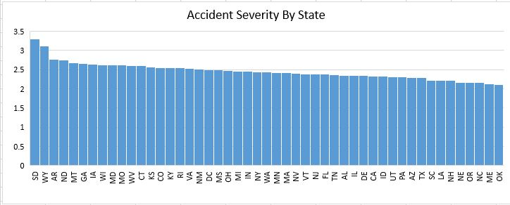
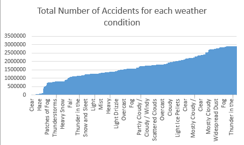

# mapReduceChoseDatasetPractice
map reduce problem for Big Data Class
## Links

## Introduction
For this project, we will be exploring the statistics of US accidents in December of 2019. We will use this data set to tell us a story which can be important to improving future road safety.

## Data Source
Local - [US Accidents Data](./data/Us_Accidents_Dec19.csv)

Original - [https://www.kaggle.com/sobhanmoosavi/us-accidents](https://www.kaggle.com/sobhanmoosavi/us-accidents)

Format - Excel CSV

Key Attributes - Start Time, End Time, State, County, City, Zip Code, Severity

Volume - 1.05 GB (3,000,000 unique entries)

Variety - Structured

Velocity - 0 because the data ends last year, only includes data from December 2019

Veracity - Most attributes are clean, but a few are messy. The trustworthiness of this dataset is a little questionable without any way to verify its integrity.

Value - This could definitely hold some value to the city or state's government. They could use this data to see where more safety precautions are needed or maybe who needs more driving guidance/ training.

## Big Data Problems

### Sammy Fields

##### The Question
For all states, I will find the highest severity.

##### The Solution
1. Mapper Input - accidents.txt
2. Mapper Output - mapped.txt
3. Reducer Output - reduced.txt
4. Best Chart Type - The best way I could find to visualize this data was to use a plain old bar chart, with the states ordered in descending order of accident severity. It's the best way to see where a state falls in comparison to the rest, as well as see if there is a general trend.

Here's the chart: 




5. Commands used (in Powershell)
  ```
  python .\mapper.py
  python .\sorter.py
  python .\reducer.py
  ```

### Nick Alee

##### The Question
For each city I will find the average temperature.

##### The Solution
1. Mapper Input - Us_Accidents_Dec19.txt
2. Mapper Output - mapped.txt
3. Reducer Output - reduced.txt
4. Best Chart Type - For this i decided to go with a histogram. The reduced data is still relativly full of different categories. due to this i chose to use a histogram showing the most average, average temperatures. the histogram is located here: https://github.com/NickAlleeProgrammingProjectsPortfolio/bigDataMapReduceOnCustomDataset/blob/master/NicksMapReducer/HistogramOfAverageTemperatures.JPG

  I have also made a neat table of the results in an excel file here: https://github.com/NickAlleeProgrammingProjectsPortfolio/bigDataMapReduceOnCustomDataset/blob/master/NicksMapReducer/graphicOfReducedData2.xlsx
  
5. Commands used
  ```
  python .\mapper.py
  ```
  ```
  python .\sorter.py
  ```
  ```
  python .\reducer.py
  ```
  
### Umesh Singh

##### The Question
For all accidents, I will find most common weather.

##### The Solution
1. Mapper Input - accidnets.txt
2. Mapper Output - mapped.txt
3. Reducer Output - reduced.txt
4. Best Chart Type - For this type of data I think bar graph is perfect visual representation. As I am only working with total number of accidents and weather condition. But both axis has huge number of data bar graph could prefectly represnt this data. The Data Visualizaion:


5. Commands used: ``` python .\mapper.py ``` ``` python .\sorter.py ``` ``` python .\reducer.py ```
